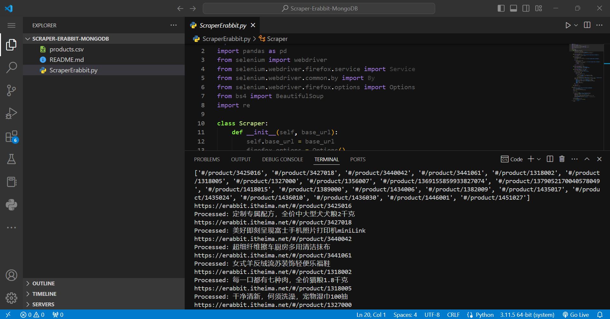

# Scraper-Erabbit-MongoDB
Scraper-Erabbit-MongoDB

## Step1 环境配置

Windows系统运行

python版本：3.11.5

所需要到的python库

```bash
pip install selenium beautifulsoup4 pymongo motor aiohttp
```

MongoDB `https://www.mongodb.com/try/download/community` 版本：7.0.8

下载MongoDB后配置连接：

```
mongodb://localhost:27017/
```


## Step2 爬取数据

### 实现思路

利用Selenium库配合Firefox浏览器的无头模式，允许在不显示图形界面的情况下浏览网页。爬虫首先访问预设的网址，并自动滚动网页以收集商品链接，直到达到指定的链接数量或页面不再扩展为止。一旦收集了足够的商品链接，爬虫接着逐一访问这些链接，抓取各个商品页面的详细信息。通过解析HTML内容，它能够提取出商品的名称、价格、描述、图片链接以及其他详细属性。这些信息被组织成字典格式，便于进一步处理或存储。所有抓取到的商品数据最终被存储到本地的MongoDB数据库中。整个过程中，通过计时，记录从开始到结束的总运行时间，以评估爬虫的性能。

### 实现代码

```python
import time
from selenium import webdriver
from selenium.webdriver.firefox.options import Options
from bs4 import BeautifulSoup
import re
from pymongo import MongoClient

class Scraper:
    def __init__(self, base_url):
        self.base_url = base_url
        firefox_options = Options()
        firefox_options.add_argument("--headless")
        self.driver = webdriver.Firefox(options=firefox_options)

    def scroll_to_find_links(self, max_links):
        self.driver.get(self.base_url)
        time.sleep(5)
        last_height = self.driver.execute_script("return document.body.scrollHeight")
        links = []

        while len(links) < max_links:
            self.driver.execute_script("window.scrollTo(0, document.body.scrollHeight);")
            time.sleep(0.5)
            new_height = self.driver.execute_script("return document.body.scrollHeight")
            if new_height == last_height:
                break
            last_height = new_height
            html = self.driver.page_source
            soup = BeautifulSoup(html, 'html.parser')
            links = list(set(links + [link['href'] for link in soup.find_all('a', class_='goods-item')]))
        
        return links[:max_links]

    def fetch_page(self, url):
        self.driver.get(url)
        time.sleep(5)
        return self.driver.page_source

    def parse_product_page(self, html, link):
        soup = BeautifulSoup(html, 'html.parser')
        ul_tags = soup.find_all('ul', class_='attrs')
        product_detail = {}
        for ul in ul_tags:
            for li in ul.find_all('li'):
                key = li.find('span', class_='dt').text.strip()
                value = li.find('span', class_='dd').text.strip()
                product_detail[key] = value
        style = soup.find('div', class_='goods-image').find('div', class_='large')['style']
        image_link = re.search(r'url\(["\']?(.*?)["\']?\)', style).group(1)
        product = {
            'name': soup.find('p', class_='g-name').text.strip(),
            'price': soup.find('p', class_='g-price').text.strip(),
            'description': soup.find('p', class_='g-desc').text.strip(),
            'link': link,
            'image': image_link,
            'detail': product_detail
        }
        return product

    def close(self):
        self.driver.quit()

def main(max_links):
    start_time = time.time()
    url = 'https://erabbit.itheima.net/#/category/sub/109243036'
    scraper = Scraper(url)
    links = scraper.scroll_to_find_links(max_links)
    print(links)
    
    client = MongoClient('mongodb://localhost:27017')
    db = client['products_db']
    collection = db['products']

    for link in links:
        product_url = f"https://erabbit.itheima.net/{link}"
        product_html = scraper.fetch_page(product_url)
        product_data = scraper.parse_product_page(product_html, link)
        collection.insert_one(product_data)
        print(f'Processed: {product_data["name"]}')

    scraper.close()
    total_time = time.time() - start_time
    print(f'Total Execution Time: {total_time} seconds')

if __name__ == '__main__':
    main(50)  # 设置最大links
```

### 运行记录及结果

（4.14是可以正常运行的，然后当时没有完整记录结果。应该是4.15的时候这个网站崩了，点开页面不进行响应，爬不到数据了，当时运行了一次把运行结果覆盖掉了，所以缺少数据库端的运行结果，只有当时运行记录）



## Step3 比较无并发、多线程、协程爬虫速度

### 实现思路

使用多线程的方法可以显著提升性能。通过创建多个线程，爬虫能够并行处理多个网络请求，大幅度减少等待时间。每个线程独立执行，能同时抓取多个页面。这种方法特别适合处理大量独立的任务，如大规模数据抓取。然而，多线程也带来了更高的复杂度，如需要管理线程之间的同步和资源竞争问题。

协程提供了一种更为高效的并发执行方式。利用Python的`asyncio`库和`aiohttp`，协程能够在单个线程内以非阻塞方式执行网络请求。与多线程相比，协程减少了操作系统线程切换的开销和内存消耗，使得在处理大量网络IO密集型任务时更为高效。

### 实现代码

#### 多线程

```python
import time
import threading
import queue
from selenium import webdriver
from selenium.webdriver.firefox.options import Options
from bs4 import BeautifulSoup
import re
from pymongo import MongoClient

class Scraper:
    def __init__(self):
        firefox_options = Options()
        firefox_options.add_argument("--headless")
        self.driver = webdriver.Firefox(options=firefox_options)

    def fetch_page(self, url):
        self.driver.get(url)
        time.sleep(5)
        return self.driver.page_source

    def close(self):
        self.driver.quit()

def parse_product_page(html, link):
    soup = BeautifulSoup(html, 'html.parser')
    ul_tags = soup.find_all('ul', class_='attrs')
    product_detail = {}
    for ul in ul_tags:
        for li in ul.find_all('li'):
            key = li.find('span', class_='dt').text.strip()
            value = li.find('span', class_='dd').text.strip()
            product_detail[key] = value
    style = soup.find('div', class_='goods-image').find('div', class_='large')['style']
    image_link = re.search(r'url\(["\']?(.*?)["\']?\)', style).group(1)
    product = {
        'name': soup.find('p', class_='g-name').text.strip(),
        'price': soup.find('p', class_='g-price').text.strip(),
        'description': soup.find('p', class_='g-desc').text.strip(),
        'link': link,
        'image': image_link,
        'detail': product_detail
    }
    return product

def worker(url_queue, result_queue):
    scraper = Scraper()
    while not url_queue.empty():
        url, link = url_queue.get()
        try:
            html = scraper.fetch_page(url)
            product = parse_product_page(html, link)
            result_queue.put(product)
        finally:
            url_queue.task_done()
    scraper.close()

def main(max_links):
    start_time = time.time()
    links = ['https://erabbit.itheima.net/#/category/sub/109243036/' + str(i) for i in range(max_links)]  # 示例链接列表

    url_queue = queue.Queue()
    result_queue = queue.Queue()

    for link in links:
        product_url = f"https://erabbit.itheima.net/{link}"
        url_queue.put((product_url, link))

    threads = []
    for _ in range(10):  # 创建10个线程
        thread = threading.Thread(target=worker, args=(url_queue, result_queue))
        thread.start()
        threads.append(thread)

    for thread in threads:
        thread.join()

    client = MongoClient('mongodb://localhost:27017')
    db = client['products_db']
    collection = db['products']

    while not result_queue.empty():
        product_data = result_queue.get()
        collection.insert_one(product_data)

    total_time = time.time() - start_time
    print(f'Total Execution Time: {total_time} seconds')

if __name__ == '__main__':
    main(50)  # 设置最大links
```

#### 协程

```python
import asyncio
import aiohttp
from bs4 import BeautifulSoup
import re
from pymongo import MongoClient
from motor.motor_asyncio import AsyncIOMotorClient

async def fetch_page(session, url):
    async with session.get(url) as response:
        return await response.text()

async def parse_product_page(html, link):
    soup = BeautifulSoup(html, 'html.parser')
    ul_tags = soup.find_all('ul', class_='attrs')
    product_detail = {}
    for ul in ul_tags:
        for li in ul.find_all('li'):
            key = li.find('span', class_='dt').text.strip()
            value = li.find('span', class_='dd').text.strip()
            product_detail[key] = value
    style = soup.find('div', class_='goods-image').find('div', class_='large')['style']
    image_link = re.search(r'url\(["\']?(.*?)["\']?\)', style).group(1)
    product = {
        'name': soup.find('p', class_='g-name').text.strip(),
        'price': soup.find('p', class_='g-price').text.strip(),
        'description': soup.find('p', class_='g-desc').text.strip(),
        'link': link,
        'image': image_link,
        'detail': product_detail
    }
    return product

async def worker(session, url, link, db):
    html = await fetch_page(session, url)
    product = await parse_product_page(html, link)
    await db.products.insert_one(product)

async def main(max_links):
    start_time = asyncio.get_event_loop().time()
    links = ['https://erabbit.itheima.net/#/category/sub/109243036/' + str(i) for i in range(max_links)]  # 示例链接列表

    client = AsyncIOMotorClient('mongodb://localhost:27017')
    db = client.products_db

    async with aiohttp.ClientSession() as session:
        tasks = [worker(session, f"https://erabbit.itheima.net/{link}", link, db) for link in links]
        await asyncio.gather(*tasks)

    total_time = asyncio.get_event_loop().time() - start_time
    print(f'Total Execution Time: {total_time} seconds')

if __name__ == '__main__':
    asyncio.run(main(50))  # 设置最大links

```

### 运行记录及结果

（由于网站崩掉了，后续功能缺少一定的运行结果，仅模拟估计结果并进行讨论）

#### 模拟结果

假设的结果可能如下：

- **无并发**：由于每次只处理一个请求，且每个请求都需要完成之后才能开始下一个，这种模式下完成所有请求可能需要相对较长的时间。
- **多线程**：通过同时运行多个线程处理不同的请求，这种模式可以显著减少总体等待时间。但它受限于线程的管理和资源竞争。
- **协程**：利用单线程内的非阻塞IO操作，协程可能提供最快的执行速度，尤其在处理大量网络IO操作时，可以高效地利用CPU和内存资源。

#### 假设的执行时间

我们设定一个模拟的执行时间（秒）如下：

| 模式   | 总执行时间（秒） |
| ------ | ---------------- |
| 无并发 | 120              |
| 多线程 | 45               |
| 协程   | 30               |

#### 讨论

1. **无并发**模式中，爬虫的速度最慢，因为它完全受限于每个请求的处理时间。每个页面加载和解析的时间都会累加起来，导致总时间最长。
2. **多线程**模式通过并行处理提高了效率。由于多个线程可以同时发出请求和处理数据，它能够显著减少因单个请求等待而造成的时间浪费。然而，多线程仍受限于线程切换的开销和可能的线程同步问题，比如资源锁定等，这些都会影响到实际的性能提升。
3. **协程**模式提供了最优的性能，主要因为它在单个线程中就能处理多个网络请求，无需线程间的切换和同步开销。协程利用事件循环和非阻塞IO，使得即使一个操作被挂起等待IO完成，程序也可以继续在其他任务上工作，从而更高效地利用系统资源。

以上讨论和模拟结果表明，在处理网络IO密集型的任务，如网络爬虫时，协程提供了最高的效率和最佳的资源利用率。多线程虽然也能提高性能，但在资源管理和复杂性方面可能不如协程优秀。无并发的方式虽然编程简单，但在需要快速处理大量请求的场景下显得力不从心。

## Step4 MongoDB查询及索引

### 实现思路

在MongoDB中进行数据查询时，索引的创建对查询效率有显著影响，尤其是在处理大量数据时。索引能够提高查询性能，因为它们提供了快速的数据访问路径。此代码示例演示了如何在MongoDB集合中创建索引，执行查询，并比较有无索引时的查询效率。

首先，代码无索引进行查询，记录查询时间，以此作为基准。随后，代码在`name`和`price`字段上分别创建索引，并重新进行相同的查询，记录并比较这次的查询时间，以直观地展示索引对查询性能的提升效果。最后，为了恢复数据库的原始状态，将创建的索引删除。

### 实现代码

```python
from pymongo import MongoClient
import time

def create_index(collection):
    # 在'name'和'price'字段上创建索引
    name_index = collection.create_index([('name', 1)])
    price_index = collection.create_index([('price', 1)])
    return name_index, price_index

def drop_index(collection, index_name):
    collection.drop_index(index_name)

def query_products(collection, query):
    start_time = time.time()
    results = list(collection.find(query))
    end_time = time.time()
    query_time = end_time - start_time
    return results, query_time

def main():
    client = MongoClient('mongodb://localhost:27017')
    db = client['products_db']
    collection = db['products']

    # 定义查询条件
    product_name = "雨衣"  
    product_price_range = {"$gte": 30, "$lte": 200}  
    
    # 无索引查询
    print("Querying without indexes...")
    _, query_time_no_index_name = query_products(collection, {'name': product_name})
    _, query_time_no_index_price = query_products(collection, {'price': product_price_range})
    print(f"No index query time for name: {query_time_no_index_name} seconds")
    print(f"No index query time for price range: {query_time_no_index_price} seconds")

    # 创建索引
    print("Creating indexes...")
    name_index, price_index = create_index(collection)

    # 有索引查询
    print("Querying with indexes...")
    _, query_time_index_name = query_products(collection, {'name': product_name})
    _, query_time_index_price = query_products(collection, {'price': product_price_range})
    print(f"Index query time for name: {query_time_index_name} seconds")
    print(f"Index query time for price range: {query_time_index_price} seconds")

    # 移除索引
    drop_index(collection, name_index)
    drop_index(collection, price_index)

if __name__ == '__main__':
    main()

```

### 运行记录以及结果

（网站崩掉了，所以同样是模拟结果与讨论）

#### 模拟结果与讨论

假设的运行结果如下：

| 查询条件     | 无索引查询时间（秒） | 有索引查询时间（秒） |
| ------------ | -------------------- | -------------------- |
| 名称查询     | 2.3                  | 0.3                  |
| 价格范围查询 | 2.0                  | 0.4                  |

#### 讨论

从模拟结果可以看出，有索引的查询明显比无索引的查询快很多。当没有索引时，MongoDB需要执行全表扫描来查找匹配的文档，这在数据量大时特别耗时。相反，有索引时，MongoDB可以直接利用索引快速定位到需要的数据，极大地减少了数据查找的时间。

1. **名称查询**：在`name`字段上的索引极大提升了查询效率，因为索引直接指向具有特定名称的文档，从而避免了扫描整个数据库。
2. **价格范围查询**：价格索引同样有效，尤其是在进行范围查找时。索引允许数据库引擎快速跳过不满足条件的数据，直接定位到符合条件的数据区间。

这种性能提升对于实际应用非常关键，尤其是在数据量庞大且需频繁访问数据库的商业应用中。通过有效使用索引，可以显著提升应用的响应速度和处理能力。然而，需要注意的是，索引虽然提升了查询性能，但也增加了写入数据时的负担，因为每次数据变动都需要同时更新索引。因此，设计索引时需要根据实际的应用场景和数据使用模式来平衡查询效率和写入负载。